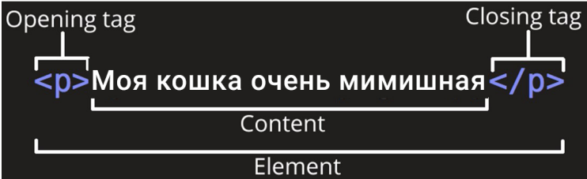
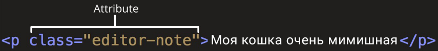
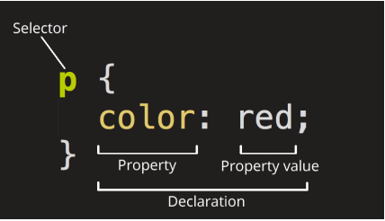
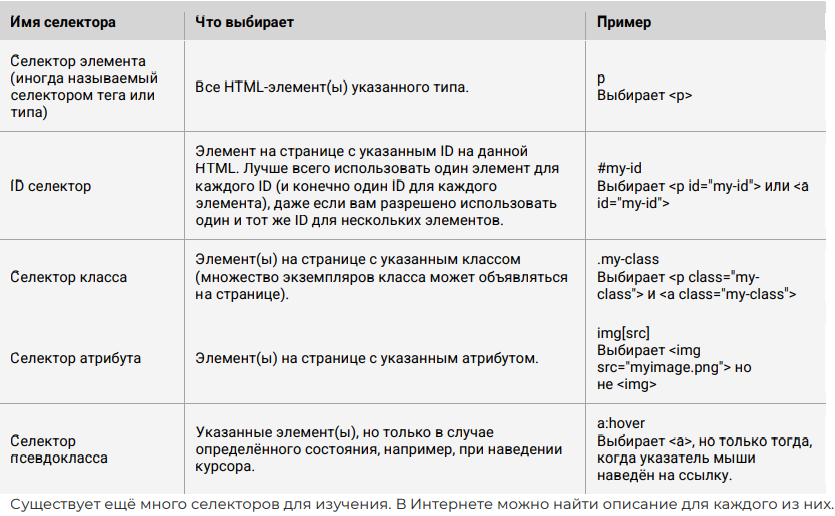
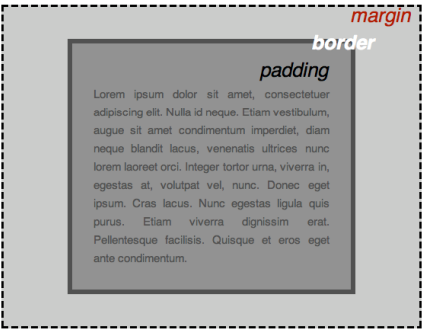

# Conspect_GeekBrains

## L2 WEB technology

### **Что такое HTML**

HTML (Hypertext Markup Language) - это код, который используется для структурирования и отображения вебстраницы и её контента. Например, контент (какой-то текст) может быть представлен в виде множества параграфов, маркированных списков или с использованием изображений и таблиц данных. Пришло время познакомиться с основами HTML и его функциями.

Разметка в HTML осуществляется с помощью тегов -- это метки, размечающие и каталогизирующие информацию для облегчения процесса поиска. Иными словами, теги -- это ключевые слова, по которым браузер ориентируется, как воспринимать и оформлять материал на сайте.

Например, предложение на сайте

``` html
Моя кошка очень мимишная
```

на самом деле будет обернуто тегами, сообщающим браузеру, что это текст абзаца, выглядит так:

``` html
<p>Моя кошка очень мимишная</p>
```

Браузер поймет эту разметку и отобразит нам только текст, без тегов и возьмет на заметку, что на этой странице есть «кошка»-содержащий текст. Если его потом поисковой робот спросит: «Нет ли у тебя чтонибудь про кошку?», он выдаст этот текст.

### Анатомия HTML элемента



Главными частями нашего элемента являются:

1.  **Открывающий тег (Opening tag)**: Состоит из имени элемента (в данном случае, "p"), заключённого в открывающие и закрывающие угловые скобки. Открывающий тег указывает, где элемент начинается или начинает действовать, в данном случае --- где начинается абзац.
2.  **Закрывающий тег (Closing tag)**: Это то же самое, что и открывающий тег, за исключением того, что он включает в себя косую черту перед именем элемента. Закрывающий элемент указывает, где элемент заканчивается, в данном случае --- где заканчивается абзац. Отсутствие закрывающего тега является одной из наиболее распространённых ошибок начинающих и может приводить к странным результатам.
3.  **Контент (Content)**: Это контент элемента, который в данном случае является просто текстом.
4.  **Элемент(Element)**: Открывающий тег, закрывающий тег и контент вместе составляют элемент. Элементы также могут иметь атрибуты, которые выглядят так:

`{<html>} <p align=”center”>Моя кошка очень мимишная</p>`

У тегов могут быть какие-либо свойства. Например, мы хотим в приведенном примере выровнять текст по центру, для этого мы будем использовать атрибут align со значением centre, которое укажем в кавычках. Атрибуты содержат дополнительную информацию об элементе, которую вы не хотите показывать в фактическом контенте.



В данном случае, **class** это имя атрибута, а **editor-note** это значение атрибута. Класс позволяет дать элементу идентификационное имя, которое может позже использоваться, чтобы обращаться к элементу с информацией о стиле и прочих вещах.

Атрибут всегда должен иметь:

1.  пробел между ним и именем элемента (или предыдущим атрибутом, если элемент уже имеет один или несколько атрибутов).
2.  имя атрибута, за которым следует знак равенства.
3.  значение атрибута, заключённое с двух сторон в кавычки.

``` html
<p>Моя кошка<strong>очень</strong>мимишная</p>
```

Будет выглядеть в браузере так: Моя кошка **очень** мимишная

**Пустые элементы**

Некоторые элементы не имеют контента, и называются пустыми элементами. Возьмём элемент , который будем использовать на нашей HTML-странице:


Он содержит два атрибута -- **src** -- для указания пути (где лежит наша картинка) и **alt** -- для подсказки (даже если картинка не загрузится, подсказка расскажет, что там должно было отображаться), но не имеет закрывающего тега , и никакого внутреннего контента. Это потому, что элемент изображения не оборачивает контент для влияния на него. Его целью является вставка изображения в HTML страницу в нужном месте.

### Анатомия HTML документа

Мы завершили изучение основ отдельных HTML элементов, но они не очень полезны сами по себе. Теперь посмотрим, как отдельные элементы объединяются в целую HTML страницу. Давайте откроем текстовый файл «первая HTML-страница.txt»:

``` html
<!DOCTYPE html>
<html>
 <head>
 <meta charset="utf-8">
 <title>Моя тестовая страница</title>
 </head>
 <body>
 
 </body>
</html>
```

Здесь мы имеем:

● **\<!DOCTYPE html\>** --- доктайп. В прошлом, когда HTML был молод (около 1991/1992), доктайпы должны были выступать в качестве ссылки на набор правил, которым HTML страница должна была следовать, чтобы считаться хорошим HTML, что могло означать автоматическую проверку ошибок и другие полезные вещи. Однако в наши дни, никто не заботится об этом, и они на самом деле просто исторический артефакт, который должен быть включён для того, что бы все работало правильно. На данный момент это все, что вам нужно знать.

● **\<html\>\</html\>** --- элемент \<html\>. Этот элемент оборачивает весь контент на всей странице, и иногда известен как корневой элемент.

● **\<head\>\</head\>** --- элемент \<head\>. Этот элемент выступает в качестве контейнера для всего, что вы пожелаете включить на HTML страницу, но не являющегося контентом, который вы показываете пользователям вашей страницы. К ним относятся такие вещи, как ключевые слова и описание страницы, которые будут появляться в результатах поиска, стили нашего контента, кодировка, подключаемые шрифты и многое другое.

● **\<body\>\</body\>** --- элемент \<body\>. В нем содержится весь контент, который вы хотите показывать пользователям, когда они посещают вашу страницу, будь то текст, изображения, видео, игры, проигрываемые аудиодорожки или что-то ещё.

● **\<meta charset="utf-8"\>** --- этот элемент устанавливает UTF-8 кодировку вашего документа, которая включает в себя большинство символов из всех известных человечеству языков. По сути, теперь документ может обрабатывать любой текстовый контент, который вы в него вложите. Нет причин не устанавливать её, так как это может помочь избежать некоторых проблем в дальнейшем.

● **\<title\>\</title\>** --- элемент \<title\>. Этот элемент устанавливает заголовок для вашей страницы, который является названием, появляющимся на вкладке браузера загружаемой страницы, и используется для описания страницы, когда вы добавляете её в закладки/избранное.

#### Изображения

``

Как было сказано раньше, код встраивает изображение на нашу страницу в нужном месте. Это делается с помощью атрибута src (source, источник), который содержит путь к нашему файлу изображения. Путь может быть указан ссылкой на любую картинку из Интернета как в нашем случае или связывать файл, находящийся на вашем диске. Для последнего нужно указать название всех папок, которые вложены друг в друга и содержат ваш файл. Например, если ваш файл 2GU.gif находится на рабочем столе учетной записи computer в папке image, то путь будет выглядеть вот так: \`undefined

`src="C:\Users\computer\Desktop\image\2GU.gif”`

Мы также включили атрибут **alt (alternative, альтернатива)**. В этом атрибуте, вы указываете поясняющий текст для пользователей, которые не могут увидеть изображение, возможно, по следующим причинам:

1.  У них присутствуют нарушения зрения. Пользователи со значительным нарушением зрения часто используют инструменты, называемые Screen Readers (экранные дикторы), которые читают для них альтернативный текст.

2.  Что-то пошло не так, в результате чего изображение не отобразилось. Например, попробуйте намеренно изменить путь в вашем атрибуте src, сделав его неверным. Если вы сохраните и перезагрузите страницу, то вы должны увидеть что-то подобное вместо изображения: Альтернативный текст - это "пояснительный текст". Он должен предоставить читателю достаточно информации, чтобы иметь представление о том, что передаёт изображение. В этом примере наш текст "Моё тестовое изображение" не годится. Намного лучшей альтернативой для нашей картинки будет "Мимишная кошечка". Давайте теперь рассмотрим некоторые из основных HTML элементов, которые нам помогут создать разметку текста для нашей веб-страницы.

#### Заголовки

Элементы заголовка позволяют указывать определённые части контента в качестве заголовков или подзаголовков. Точно так же, как книга имеет название, названия глав и подзаголовков, HTML документ может содержать то же самое. HTML включает шесть уровней заголовков (en-US)--(en-US), хотя обычно мы будем использовать не более 3-4 :

``` html
<h1>Мой главный заголовок</h1>
<h2>Мой заголовок верхнего уровня</h2>
<h3>Мой подзаголовок</h3>
<h4>Мой под-подзаголовок</h4>
```

#### Абзацы

Как было сказано ранее, элемент`<p>`предназначен для абзацев текста; вы будете использовать их регулярно при разметке текстового контента: `<p>Это одиночный абзац</p>`

#### Списки

Большая часть веб-контента является *списками* и HTML имеет специальные элементы для них. Разметка списка всегда состоит по меньшей мере из двух элементов. Наиболее распространёнными типами списков являются нумерованные и ненумерованные списки:

1.  *Ненумерованные списки* - это списки, где порядок пунктов не имеет значения, как в списке покупок. Они оборачиваются в элемент `<ul>`.
2.  *Нумерованные списки* - это списки, где порядок пунктов имеет значение, как в рецепте. Они оборачиваются в элемент `<ol>`. Каждый пункт внутри списков располагается внутри элемента `<li>` (list item, элемент списка). Например, если мы хотим включить часть следующего фрагмента абзаца в список:

`<p> Живёт у меня кошечка Соня... </p>`

Мы могли бы изменить разметку на эту:

``` html
<p>Живут у меня кошечки:</p>
<ul>
 <li>Соня</li>
 <li>Муся</li>
 <li>Пуся</li>
</ul>
<p>вместе ... </p>
```

#### Ссылки

Ссылки очень важны --- это то, что делает Интернет Интернетом. Чтобы добавить ссылку, нам нужно использовать простой элемент ---`<a>` --- a это сокращение от *"anchor" ("якорь")*. Чтобы текст в вашем абзаце стал ссылкой, выполните следующие действия:

1.  Выберите текст "О кошечках".
2.  Обернем текст в элемент , например так: `<a>О кошечках</a>`
3.  Зададим элементу `<a>` атрибут `href`, например так:`<a href="">О кошечках</a>` Заполним значение этого атрибута веб-адресом, на который хотим указать ссылку и сделаем из ссылки заголовок:`<h1><a href="https://www.murcat.ru/">О кошечках</a></h1>`

Познакомившись с возможностями HTML, мы увидели, на что он способен. Это классно, но пока это не похоже на современный сайт. Нам нужны дополнительные инструменты -- и это *CSS (Cascading Style Sheets)*.

### Основы CSS

**CSS (Cascading Style Sheets)** --- это код, который вы используете для стилизации вашей веб-страницы. Основы CSS помогут сделать текст черным или красным, поставить контент в определённом месте на экране, украсить веб-страницу с помощью фоновых изображений и цветов.

Как и HTML, CSS на самом деле не является языком программирования. Это не язык разметки - это язык таблицы стилей. Это означает, что он позволяет применять стили выборочно к элементам в документах HTML. Например, чтобы *выбрать все элементы абзаца на HTML странице и изменить текст внутри них с чёрного на красный*, необходимо написать этот CSS код:

```         
p {
 color: red;
}
```

Давайте вставим эти три строки CSS в новый файл в ваш текстовый редактор, а затем сохраним файл как style.css в вашей папке styles (в ту же папку, где находится наша страница «первая HTML-страница.html»). Но нам всё равно нужно применить CSS к нашему HTML документу. В противном случае, CSS стиль не повлияет на то, как ваш браузер отобразит HTML документ.

1.  Откройте ваш файл index.html и вставьте следующую строку куда-нибудь в шапку, между `<head>` и `</head>` тегами: `<link href="styles/style.css" rel="stylesheet" type="text/css">`

2.  Сохраните index.html и загрузите его в вашем браузере. Вы должны увидеть что-то вроде этого:

#### Анатомия набора правил CSS

Давайте взглянем на вышеупомянутый CSS немного более подробно:



**Селектор (Selector)**

Имя HTML-элемента в начале набора правил. Он выбирает элемент(ы) для применения стиля (в данном случае, элементы p ). Для стилизации другого элемента, просто измените селектор.

**Объявление (Declaration)**

Единственное правило, например color: red; указывает, какие из свойств элемента вы хотите стилизовать.

**Свойства (Properties)**

Способы, которыми вы можете стилизовать определённый HTML-элемент (в данном случае, color является свойством для элементов ). В CSS вы выбираете, какие свойства вы хотите затронуть в вашем правиле.

**Значение свойства (Property value)**

Справа от свойства, после двоеточия, у нас есть значение свойства, которое выбирает одно из множества возможных признаков для данного свойства (существует множество значений color, помимо red).

Обратите внимание на важные части синтаксиса:

● Каждый набор правил (кроме селектора) должен быть обёрнут в фигурные скобки ({}).

● В каждом объявлении необходимо использовать двоеточие (:), чтобы отделить свойство от его значений.

● В каждом наборе правил вы должны использовать точку с запятой (;), чтобы отделить каждое объявление от следующего. Таким образом, чтобы изменить несколько значений свойств сразу, вам просто нужно написать их, разделяя точкой с запятой, например так:

``` html
p {
 color: red;
 width: 500px;
 border: 1px solid black;
}
```

**Выбор нескольких элементов**

Вы также можете выбрать несколько элементов разного типа и применить единый набор правил для всех из них. Добавьте несколько селекторов, разделённых запятыми. Например:

``` html
p,li,h1 {
 color: red;
}
```

##### **Разные типы селекторов**



##### Шрифты и текст

Теперь, когда мы изучили некоторые основы CSS, давайте добавим ещё несколько правил и информацию в наш файл style.css, чтобы наш пример хорошо выглядел. Прежде всего, давайте сделаем, чтобы наши шрифты и текст выглядели немного лучше.

1.  Давайте зададим шрифт нашей страницы. По умолчанию браузер задает всему тексту шрифт Times New Roman, но как-то это не современно. Мы свяжем наш сайт со шрифтом Roboto взятый с Google Font. Для этого просто добавьте элемент `<link>` где-нибудь внутри шапки вашего index.html (снова, в любом месте между тегами `<head>и</head>`). Это будет выглядеть примерно так:

```         
<link href="https://fonts.googleapis.com/css2?family=Roboto&display=swap"
rel="stylesheet" type='text/css'>
```

Этот код связывает вашу страницу с таблицей стилями, которая загружает семейство шрифтов Roboto вместе с вашей страницей и позволяет вам применять их к вашим HTML-элементам используя свою собственную таблицу стилей.

2.  Затем, удалите существующее правило в вашем style.css файле. Это был хороший тест, но красный текст, на самом деле, не очень хорошо выглядит.
3.  Добавьте следующие строки в нужное место. Это правило устанавливает глобальный базовый шрифт и размер шрифта для всей страницы (поскольку является родительским элементом для всей страницы, и все элементы внутри него наследуют такой же font-size и font-family):

```         
html {
 font-size: 15px; /* px значит 'пиксели': базовый шрифт будет 10 пикселей в
высоту */
 font-family: 'Roboto', sans-serif;
}
```

4.  Примечание: Все в CSS документе между /\* и \*/ является CSS комментарием, который браузер игнорирует при исполнении кода. Это место, где вы можете написать полезные заметки о том, что вы делаете.
5.  Теперь мы установим размер шрифта для элементов, содержащих текст внутри HTML тела ( (enUS), , и ). Мы также отцентрируем текст нашего заголовка и установим некоторую высоту строки и расстояние между буквами в теле документа, чтобы сделать его немного более удобным для чтения: Вы можете настроить значения px так, как вам нравится, чтобы ваш дизайн выглядел так, как вы хотите, но, в общем, ваш дизайн должен выглядеть вот так:

Не удивительно, макет CSS основан, главным образом, на блочной модели (box model). Каждый из блоков, занимающий пространство на вашей странице имеет такие свойства, как:

● **padding**, пространство только вокруг контента (например, вокруг абзаца текста)

● **border**, сплошная линия, которая расположена рядом с padding

● **margin**, пространство вокруг внешней стороны элемента

{width="516"}

В этом разделе мы также используем:

● **width** (ширину элемента)

● **background-color**, цвет позади контента и padding элементов

● **color**, цвет контента элемента (обычно текста)

● **text-shadow**: устанавливает тень на тексте внутри элемента

● **display**: устанавливает режим отображения элемента (пока что не волнуйтесь об этом)

Итак, давайте начнём и добавим больше CSS на нашей странице! Продолжайте добавлять эти новые правила, расположенные в нижней части страницы, и не бойтесь экспериментировать с изменением значений, чтобы увидеть, как это работает.

**Изменение цвета страницы**

```         
html {
 background-color: #FFEFD5;
}
```

##### Разбираемся с телом

```         
body {
 width: 600px;
 margin: 0 auto;
 background-color: #FFE4B5;
 padding: 0 20px 20px 20px;
 border: border: 2px solid white;
}
```

Теперь для `<body>` элемента. Здесь есть немало деклараций, так что давайте пройдём через них всех по одному:

● **width**: 600px; --- заставляет тело быть всегда 600 пикселей в ширину.

● **margin**: 0 auto; --- когда вы устанавливаете два значения для таких свойств как margin или padding, первое значение элемента влияет на верхнюю и нижнюю сторону (делает их 0 в данном случае), и второе значение на левую и правую сторону (здесь, auto является особым значением, которое делит доступное пространство по горизонтали поровну слева и справа). Вы также можете использовать один, три или четыре значения, как описано здесь.

● **background-color**: #FF9500; --- как и прежде, устанавливает цвет фона элемента. Я использовал красновато-оранжевый для тела, в отличие от темно-синего цвета для элемента, но не стесняйтесь и экспериментируйте.

● **padding**: 0 20px 20px 20px; --- у нас есть четыре значения, установленные для padding, чтобы сделать немного пространства вокруг нашего контента. В этот раз мы не устанавливаем padding на верхней части тела, но делаем 20 пикселей слева, снизу и справа. Значения устанавливаются сверху, справа, снизу, слева, в таком порядке.

● **border**: 5px solid black; --- просто устанавливает сплошную чёрную рамку шириной 5 пикселей со всех сторон тела.

##### Позиционирование и стилизация нашего заголовка главной страницы

```         
h1 {
 margin: 0;
 padding: 20px 0;
 text-shadow: 2px 2px 1px white;
}
```

Вы, возможно, заметили, что есть ужасный разрыв в верхней части тела. Это происходит, потому что браузеры применяют некоторый стиль по умолчанию для элемента `<h1> (en-US)` (по сравнению с другими), даже если вы не применяли какой-либо CSS вообще! Это может звучать как плохая идея, но мы хотим, чтобы вебстраница без стилей имела базовую читаемость. Чтобы избавиться от разрыва, мы переопределили стиль по умолчанию, установив `margin: 0;`. Затем мы установили заголовку верхний и нижний `padding на 20 пикселей`, и сделали текст заголовка того же цвета, как и цвет фона html. Здесь, мы использовали одно довольно интересное свойство - это `text-shadow`, которое применяет тень к текстовому контенту элемента. Оно имеет следующие четыре значения:

● Первое значение пикселей задаёт **горизонтальное смещение** тени от текста --- как далеко она движется поперёк: отрицательное значение должно двигать её влево.

● Второе значение пикселей задаёт **вертикальное смещение** тени от текста --- как далеко она движется вниз, в этом примере: отрицательное значение должно переместить её вверх.

● Третье значение пикселей задаёт **радиус размытия тени** --- большее значение будет означать более размытую тень.

● Четвёртое значение задаёт **основной цвет тени**

##### Центрирование изображения

``` css
img {
 display: block;
 margin: 0 auto;
}
```

------------------------------------------------------------------------

## Seminar 2 Создание сайта с нуля

### 1. Необходимые программы

1.  VSC или SubLime Text

2.  Wireframe.cc (сайт)

3.  

**Начало работы в VSC:**

1.  Создаем папку проекта, добавляем файл **index.html**

2.  В файле нажимаем **shift+!** (VSC) / В SubLime добавляем `<html>` - автоматически создадутся блоки.

``` html
<!DOCTYPE html>
<html lang="en">

<head>
    <meta charset="UTF-8">
    <meta name="viewport" content="width=device-width, initial-scale=1.0"> 
    # name = видовое окно, область которую будет видеть пользователь (<body>....</body>)
    content = width=device-width - как он будет отображаться (по ширине контента в любом уст.),
    initial-scale=1.0 - масштаб (100%, shift- уменьшает контент)
    <title>Document</title> название  в поисковой строке сверху
</head>

<body>
    <header class="main-header"> #(создаем header, создаем класс)
        <div class="main-header__logo" # в классе header создаем logo через div (строчное расположение)
</body>
</html>
```

3.  Для предварительного просмотра в VSC нажимаем goLive(на нижней панели) - открывается страница в браузере для предпросмотра.
